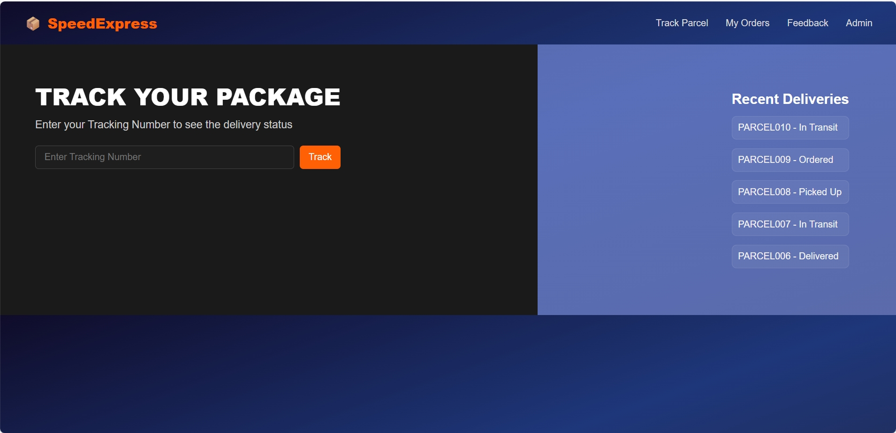
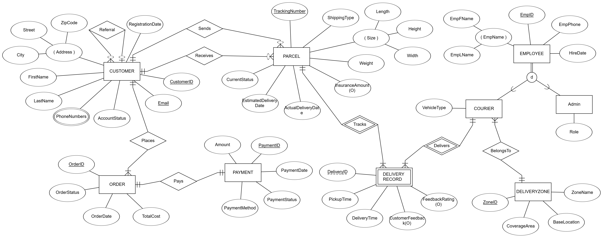
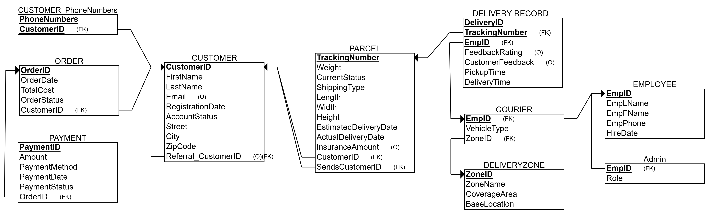

# SpeedExpress: Parcel Tracking and Management System

SpeedExpress is a full-stack logistics system designed to support the core operations of a courier company, including package tracking, customer order management, courier dispatch, delivery records, and customer feedback.

### Contributors

* Hanbo "David" Luo - hanbol3
* Zhouyang Yu - zyu44
* Siyu Chen - siyu10

**Instructor:** Kahyun Choi  
**Project template:** Provided by TA: Ziyang Zheng (ziyangz5)  

## Features

- **Track Parcel**: Customers can track real-time package status using a tracking number.
- **My Orders**: View order details including cost, payment method, package info, and delivery status.
- **Feedback**: Submit feedback for completed deliveries.
- **Courier Dispatch Dashboard** (Admin only): View courier performance metrics including total deliveries, last delivery time, and delivery zone.
- **Delivery Record Log**: Review delivery history of a specific courier with feedback and rating.

Project Link: https://github.com/HanboLuo/IS-455_Fin_Proj

## Step 1. Database Scenario

We designed a database system for a logistics company called SpeedExpress. The company specializes in same-city and cross-city courier service and has over 200 couriers and over 10,000 registered customers.

### Database Purpose

The database is designed to support the core business processes (Business Process) of the courier company, including:
* Customer Order Management (Order Management)
* Parcel (Parcel) tracking (Tracking)
* Courier dispatch (Courier Dispatch)
* Delivery Record (Delivery Record) tracking
* Customer feedback (Feedback) collection

### Target Users
1. **Customers:** through the website or APP to place an order, tracking packages, submit feedback
2. **Courier:** receive delivery tasks, update the status of the package (Status)
3. **Administrator:** monitor operations, generate reports, manage user accounts 
4. **Customer Service Representative (CSR):** Handle customer inquiries and complaints.


## Step 2. Front-end Interface

<p align="center">
  
  <br/>
  <strong>Figure 1.</strong> SpeedExpress Frontend Interface
</p>


## Step 3. Database Requirements

### Entity & Attribute Requirements

### 1. Attribute in Customer
**Database Requirements for Attribute in Customer**  
Each customer in the system has a unique Customer ID as the primary key. Customers must provide their full name, stored as separate First Name and Last Name attributes. A unique Email address is required for registration, serving as the customer's login identifier. The system supports multiple Phone Numbers per customer (a multivalued attribute) to accommodate alternate contact methods. The customer's Address is modeled as a composite attribute with sub-attributes: Street, City, and Zip Code. The Registration Date is automatically recorded to track customer tenure. An Account Status field (Active/Inactive) manages account visibility.

### 2. Attribute in Parcel
**Database Requirements for Attribute in Parcel**  
Each parcel is uniquely identified by a Tracking Number. It includes key delivery details such as Shipping Type, Weight (in kilograms), and a composite Size attribute containing Length, Width, and Height (in centimeters). The Current Status tracks the progress of the parcel through stages such as "Ordered", "Picked Up", "In Transit", and "Delivered". The Estimated Delivery Date is calculated upon dispatch, while Actual Delivery Date is derived upon successful delivery. An optional Insurance Amount can be specified to indicate the parcel’s declared value.

### 3. Attribute in Employee
**Database Requirements for Attribute in Employee**  
All employees share a common structure defined by a unique Employee ID, a composite Employee Name (divided into EmpFName and EmpLName), a phone number for contact purposes, and the Hire Date indicating when the employee joined the organization. This structure forms the basis for general employee management across subtypes.

### 4. Attribute in Admin
**Database Requirements for Attribute in Admin**  
Admins are specialized employees responsible for system administration. In addition to the inherited employee attributes, each Admin record contains a Role attribute, which defines the admin's permission level or area of responsibility (e.g., account management, reporting).

### 5. Attribute in Courier
**Database Requirements for Attribute in Courier**  
Couriers are a subtype of employees who handle parcel delivery. Each courier has a Vehicle Type attribute indicating their mode of transportation, such as Motorcycle, Van, or Truck. They are also assigned to a specific delivery zone, which is referenced in the ZoneID attribute. All general employee information is inherited from the Employee entity.

### 6. Attribute in DeliveryZone
**Database Requirements for Attribute in DeliveryZone**  
Each delivery zone is uniquely identified by a Zone ID. Descriptive attributes include Zone Name, which represents the name or code for the zone, Coverage Area, which describes the geographical scope, and Base Location, identifying the central hub or depot from which deliveries in that zone are managed.

### 7. Attribute in DeliveryRecord
**Database Requirements for Attribute in DeliveryRecord**  
A delivery record documents the process of delivering a parcel. Each record has a partially unique Delivery ID, along with Pickup Time and Delivery Time to track the lifecycle of the delivery. Optional fields include Customer Feedback (text-based comments) and a Feedback Rating on a scale from 1 to 5. These attributes are collected after delivery to monitor service quality.

### 8. Attribute in Order
**Database Requirements for Attribute in Order**  
Orders are uniquely identified by an Order ID. The entity also stores the Order Date when the transaction was initiated, the Total Cost calculated from shipment charges, and the Order Status, which indicates the current state of the order (e.g., pending, completed, cancelled).

### 9. Attribute in Payment
**Database Requirements for Attribute in Payment**  
Payments are tracked using a unique Payment ID. Each payment includes an Amount paid, the Payment Method used (such as credit card, PayPal, etc.), the Payment Date when the transaction was processed, and the Payment Status, which shows whether the payment was completed, pending, or failed.


### Relationship Requirements

1) **Referral** (Recursive Relationship)  
From Customer → Customer  
One customer can refer many others  
Cardinality: 1 to many  
Participation: Both optional  

2) **Places**  
Customer → Order  
One customer can place many orders  
Participation: Both mandatory  

3) **Pays**  
Order → Payment  
One-to-one mapping between order and payment  
Participation: Both mandatory   

 4) **Delivers** (Identifying)  
Courier → DeliveryRecord  
One courier can complete many deliveries  
Participation: Both mandatory  

 5) **Tracks** (Identifying)  
Parcel → DeliveryRecord  
Each delivery record belongs to one parcel  
Participation: Both mandatory  

 6) **BelongsTo**
Courier → DeliveryZone  
Many couriers belong to one zone  
Participation: Both mandatory  

7) **Sends**  
Customer → Parcel  
One customer can send many parcels  
Participation: Both mandatory  

 8) **Receives**   
Customer → Parcel  
One customer can receive many parcels  
Participation: Both mandatory  


## Step 4. EERD

<p align="center">
  
  <br/>
  <strong>Figure 2.</strong> EERD of SpeedExpress
</p>


## Step 5. Relational Schema

<p align="center">
  
  <br/>
  <strong>Figure 3.</strong> Relational Schema of SpeedExpress
</p>


## Step 6. Normalization (and Denormalization)

### 1. Original Structures: `Table (Attributes)`

**Customer** (CustomerID, FirstName, LastName, Email, PhoneNumbers, Address, RegistrationDate, AccountStatus)  

**Parcel** (TrackingNumber, SenderID, ReceiverID, Weight, Size, ShippingType, CurrentStatus, EstimatedDeliveryDate, ActualDeliveryDate, InsuranceAmount)  

**Courier** (CourierID, FirstName, LastName, Phone, VehicleType, EmploymentDate, ZoneID, ZoneName, CoverageArea, BaseLocation)  

**DeliveryZone** (ZoneID, ZoneName, CoverageArea, BaseLocation)  

**DeliveryRecord** (DeliveryID, TrackingNumber, CourierID, PickupTime, DeliveryTime, CustomerFeedback, FeedbackRating)  

**Order** (OrderID, CustomerID, OrderDate, TotalCost, PaymentStatus)  

**Payment** (PaymentID, OrderID, Amount, PaymentMethod, PaymentDate, PaymentStatus)  


### 2. Normalization

1) Customer was normalized into multiple relations to address multivalued and composite attributes:

    **Customer** (CustomerID, FirstName, LastName, Email, RegistrationDate, AccountStatus)  
    **CustomerPhone** (CustomerID, PhoneNumber)  
    **CustomerAddress** (CustomerID, AddressID, Street, City, ZipCode)

2) Courier was normalized by extracting zone-related information into a separate table:

    **Courier** (CourierID, FirstName, LastName, Phone, VehicleType, EmploymentDate, ZoneID)  
    **DeliveryZone** (ZoneID, ZoneName, CoverageArea, BaseLocation)

3) The Employee supertype was used to avoid data duplication across employee roles:

    **Employee** (EmployeeID, EmpFName, EmpLName, EmployeePhone, HireDate)  
    **Courier** (EmployeeID, VehicleType, ZoneID)  
    **Admin** (EmployeeID, Role)

4) The Parcel entity's composite attribute Size was decomposed:

    **Parcel** (TrackingNumber, SenderID, ReceiverID, Weight, Length, Width, Height, ShippingType, CurrentStatus, EstimatedDeliveryDate, ActualDeliveryDate, InsuranceAmount)

5) All other tables were confirmed to be in 3NF:

    **DeliveryRecord** (DeliveryID, TrackingNumber, CourierID, PickupTime, DeliveryTime, CustomerFeedback, FeedbackRating)  
    **Order** (OrderID, CustomerID, OrderDate, TotalCost, PaymentStatus)  
    **Payment** (PaymentID, OrderID, Amount, PaymentMethod, PaymentDate, PaymentStatus)


### 3. Denormalization

To optimize query performance, ActualDeliveryDate is retained in the Parcel table, although this value can be derived from the associated DeliveryRecord. This design reduces the need for frequent JOIN operations during parcel tracking queries. Data consistency between Parcel and DeliveryRecord will be enforced at the application level or through database triggers.


## Step 7. Create and Populate Database

**SQL File:** [set7.sql](SQL/set7.sql)

***Where does your data come from if you didn't create all the data alone?***

When creating the SpeedExpress Delivery System Database, we referred to real-world 
delivery platforms, logistics schema designs, and public company operations data 
available online. These references helped us define the database tables and generate 
realistic and coherent sample data.


***For a few attributes, why did you select the data types?***

We selected appropriate data types to ensure data accuracy, consistency, and efficient 
querying. For example:  
* DATE and DATETIME were used to represent critical time-based attributes such 
as order date, pickup time, and delivery date. 
* DECIMAL types were chosen for currency-related fields such as shipping costs 
and insurance amounts to avoid floating-point precision issues.

In addition, we implemented primary keys, foreign keys, and constraints to uphold 
referential integrity and prevent invalid entries. While populating the database, we 
ensured that the data remained internally consistent and suitable for subsequent 
query testing and reporting.


## Step 8. SQL Queries

**SQL File:** [set8.sql](SQL/set8.sql)

***Among your ten queries, pick three queries and state how they are closely related 
to the purpose and intended users of your database.***

We developed ten SQL queries to explore different operational and user-facing aspects 
of the system. Among them, we highlight three key queries that demonstrate direct 
application integration and support for interactive usage. 

#### **Query 2: Customers With and Without Orders (Outer Join)**

```sql
SELECT c.CustomerID, c.FirstName, c.LastName, o.OrderID, o.OrderDate, o.TotalCost  
FROM Customer c  
LEFT OUTER JOIN `Order` o ON c.CustomerID = o.CustomerID;
```

**Purpose:** This is intended for customer service representatives who need visibility into customer 
engagement, especially to prompt reactivation for customers without recent activity. 

#### **Query 3: Count Deliveries per Courier**

```sql
SELECT c.CourierID, e.EmpFName, e.EmpLName, COUNT(dr.DeliveryID) AS DeliveryCount  
FROM Courier c  
JOIN Employee e ON c.CourierID = e.EmployeeID  
JOIN DeliveryRecord dr ON c.CourierID = dr.CourierID  
GROUP BY c.CourierID, e.EmpFName, e.EmpLName;  
```

**Purpose:** This query provides real-time courier performance data, supporting internal interfaces 
used by operations managers to oversee resource allocation and workload balancing.

#### **Query 5: Average Order Cost per Customer**

```sql
SELECT c.CustomerID, c.FirstName, c.LastName, AVG(o.TotalCost) AS AvgOrderCost  
FROM Customer c  
JOIN `Order` o ON c.CustomerID = o.CustomerID  
GROUP BY c.CustomerID, c.FirstName, c.LastName;
```

**Purpose:** 
This query can be integrated into customer dashboards to enable dynamic user 
segmentation and personalized promotions driven by spending behavior. 


***If your queries are for direct interactions with end-users via an application, 
answer the following questions： 
What is the application? Who are the users?***

For this section, we chose to address the branch:  
"If your queries are part of an application and interact directly with end users."

The application is the **SpeedExpress Delivery Tracking and Order Management 
System**, which includes: 

* A web-based interface for customers to view order status and delivery progress. 
* An internal portal for customer service representatives and administrators to 
access real-time customer and delivery information.

The users include: 

* **Customers**, who check their order history, parcel status, and payment records 
via the front-end interface. 
* **Customer service agents**, who need visibility into customer activity (e.g., 
inactive users, feedback, pending payments) for support and outreach. 
* **Admin staff**, who rely on operational queries (like courier delivery count) for real
time dashboard displays.


## Step 9. Convert the Relational Database to MongoDB

**Script File:** [convert_to_mongo.js](MongoDB/convert_to_mongo.js)

This script transforms the relational schema into MongoDB documents using embedded subdocuments and arrays for natural document modeling. It merges normalized tables like `Customer`, `CustomerPhone`, `CustomerAddress`, `Order`, `Parcel`, and `DeliveryRecord` into nested structures.

```javascript
// Step 9: Convert the relational database to MongoDB

// Create a new database
use SpeedExpressDB

// Customer collection
// Merge Customer, CustomerPhone, and CustomerAddress into a single document collection
db.createCollection("Customer")
db.Customer.insertMany([
    {
        firstName: "John",
        lastName: "Doe",
        email: "john.doe@example.com",
        registrationDate: new Date("2022-01-15"),
        accountStatus: "Active",
        phones: ["123-456-7890", "234-567-8901"],
        addresses: [
            {
                street: "123 Main St",
                city: "Anytown",
                zipCode: "12345"
            }
        ],
        orders: [
            {
                orderID: 1,
                orderDate: new Date("2022-01-15 14:20:00"),
                totalCost: 15.00,
                paymentStatus: "Completed",
                payment: {
                    paymentID: 1,
                    amount: 15.00,
                    paymentMethod: "Credit Card",
                    paymentDate: new Date("2022-01-15 14:30:00"),
                    paymentStatus: "Completed"
                }
            }
        ],
        parcels: [
            {
                trackingNumber: "PARCEL001",
                role: "Sender",
                weight: 2.5,
                length: 30,
                width: 20,
                height: 10,
                shippingType: "Standard",
                currentStatus: "Delivered",
                estimatedDeliveryDate: new Date("2022-01-20"),
                actualDeliveryDate: new Date("2022-01-22"),
                insuranceAmount: 100.00,
                deliveryRecord: {
                    courierID: 6,
                    pickupTime: new Date("2022-01-18 09:00:00"),
                    deliveryTime: new Date("2022-01-22 14:30:00"),
                    customerFeedback: "Great service!",
                    feedbackRating: 5
                }
            },
            {
                trackingNumber: "PARCEL002",
                role: "Receiver",
                weight: 5.0,
                length: 40,
                width: 30,
                height: 20,
                shippingType: "Express",
                currentStatus: "In Transit",
                estimatedDeliveryDate: new Date("2022-02-25"),
                deliveryRecord: {
                    courierID: 7,
                    pickupTime: new Date("2022-02-22 10:15:00"),
                    deliveryTime: null,
                    customerFeedback: null,
                    feedbackRating: null
                }
            }
        ]
    },
    {
        firstName: "Jane",
        lastName: "Smith",
        email: "jane.smith@example.com",
        registrationDate: new Date("2022-02-20"),
        accountStatus: "Active",
        phones: ["345-678-9012"],
        addresses: [
            {
                street: "456 Oak Ave",
                city: "Oakville",
                zipCode: "67890"
            }
        ],
        orders: [
            {
                orderID: 2,
                orderDate: new Date("2022-02-20 10:30:00"),
                totalCost: 25.00,
                paymentStatus: "Pending",
                payment: {
                    paymentID: 2,
                    amount: 25.00,
                    paymentMethod: "PayPal",
                    paymentDate: new Date("2022-02-20 10:40:00"),
                    paymentStatus: "Pending"
                }
            }
        ],
        parcels: [
            {
                trackingNumber: "PARCEL002",
                role: "Sender",
                weight: 5.0,
                length: 40,
                width: 30,
                height: 20,
                shippingType: "Express",
                currentStatus: "In Transit",
                estimatedDeliveryDate: new Date("2022-02-25"),
                deliveryRecord: {
                    courierID: 7,
                    pickupTime: new Date("2022-02-22 10:15:00"),
                    deliveryTime: null,
                    customerFeedback: null,
                    feedbackRating: null
                }
            },
            {
                trackingNumber: "PARCEL003",
                role: "Receiver",
                weight: 1.8,
                length: 25,
                width: 15,
                height: 8,
                shippingType: "Standard",
                currentStatus: "Picked Up",
                estimatedDeliveryDate: new Date("2022-03-15"),
                deliveryRecord: {
                    courierID: 8,
                    pickupTime: new Date("2022-03-12 13:45:00"),
                    deliveryTime: null,
                    customerFeedback: null,
                    feedbackRating: null
                }
            }
        ]
    },
    // Insert other customer data similarly
])

// Employee collection
// Merge Employee, Admin, and Courier into a single document collection
db.createCollection("Employee")
db.Employee.insertMany([
    {
        empFName: "Tom",
        empLName: "Wilson",
        employeePhone: "111-222-3333",
        hireDate: new Date("2020-01-01"),
        role: "Account Management",
        isCourier: false
    },
    {
        empFName: "Amy",
        empLName: "Anderson",
        employeePhone: "222-333-4444",
        hireDate: new Date("2020-02-15"),
        role: "Reporting",
        isCourier: false
    },
    {
        empFName: "John",
        empLName: "Miller",
        employeePhone: "333-444-5555",
        hireDate: new Date("2020-03-10"),
        role: "System Administration",
        isCourier: false
    },
    {
        empFName: "Lisa",
        empLName: "Moore",
        employeePhone: "444-555-6666",
        hireDate: new Date("2020-04-20"),
        role: "Data Analysis",
        isCourier: false
    },
    {
        empFName: "David",
        empLName: "Taylor",
        employeePhone: "555-666-7777",
        hireDate: new Date("2020-05-05"),
        role: "User Management",
        isCourier: false
    },
    {
        empFName: "Michael",
        empLName: "Johnson",
        employeePhone: "666-777-8888",
        hireDate: new Date("2020-06-12"),
        role: null,
        isCourier: true,
        courierDetails: {
            vehicleType: "Motorcycle",
            zoneID: 1,
            zoneName: "Zone A",
            coverageArea: "Downtown Area",
            baseLocation: "Hub A"
        }
    },
    {
        empFName: "Emily",
        empLName: "Brown",
        employeePhone: "777-888-9999",
        hireDate: new Date("2020-07-18"),
        role: null,
        isCourier: true,
        courierDetails: {
            vehicleType: "Van",
            zoneID: 2,
            zoneName: "Zone B",
            coverageArea: "Suburban Area",
            baseLocation: "Hub B"
        }
    },
    {
        empFName: "Kevin",
        empLName: "Davis",
        employeePhone: "888-999-0000",
        hireDate: new Date("2020-08-22"),
        role: null,
        isCourier: true,
        courierDetails: {
            vehicleType: "Truck",
            zoneID: 3,
            zoneName: "Zone C",
            coverageArea: "Rural Area",
            baseLocation: "Hub C"
        }
    },
    {
        empFName: "Sarah",
        empLName: "Wilson",
        employeePhone: "999-000-1111",
        hireDate: new Date("2020-09-25"),
        role: null,
        isCourier: true,
        courierDetails: {
            vehicleType: "Motorcycle",
            zoneID: 1,
            zoneName: "Zone A",
            coverageArea: "Downtown Area",
            baseLocation: "Hub A"
        }
    },
    {
        empFName: "Alexander",
        empLName: "Martinez",
        employeePhone: "000-111-2222",
        hireDate: new Date("2020-10-30"),
        role: null,
        isCourier: true,
        courierDetails: {
            vehicleType: "Van",
            zoneID: 2,
            zoneName: "Zone B",
            coverageArea: "Suburban Area",
            baseLocation: "Hub B"
        }
    }
])

// DeliveryZone collection
db.createCollection("DeliveryZone")
db.DeliveryZone.insertMany([
    {
        zoneID: 1,
        zoneName: "Zone A",
        coverageArea: "Downtown Area",
        baseLocation: "Hub A"
    },
    {
        zoneID: 2,
        zoneName: "Zone B",
        coverageArea: "Suburban Area",
        baseLocation: "Hub B"
    },
    {
        zoneID: 3,
        zoneName: "Zone C",
        coverageArea: "Rural Area",
        baseLocation: "Hub C"
    },
    {
        zoneID: 4,
        zoneName: "Zone D",
        coverageArea: "North Area",
        baseLocation: "Hub D"
    },
    {
        zoneID: 5,
        zoneName: "Zone E",
        coverageArea: "South Area",
        baseLocation: "Hub E"
    },
    {
        zoneID: 6,
        zoneName: "Zone F",
        coverageArea: "East Area",
        baseLocation: "Hub F"
    },
    {
        zoneID: 7,
        zoneName: "Zone G",
        coverageArea: "West Area",
        baseLocation: "Hub G"
    },
    {
        zoneID: 8,
        zoneName: "Zone H",
        coverageArea: "Central Area",
        baseLocation: "Hub H"
    },
    {
        zoneID: 9,
        zoneName: "Zone I",
        coverageArea: "Westside Area",
        baseLocation: "Hub I"
    },
    {
        zoneID: 10,
        zoneName: "Zone J",
        coverageArea: "Eastside Area",
        baseLocation: "Hub J"
    }
])

// Parcel collection (optional, as parcels can be embedded within Customer documents)
// If a separate Parcel collection is needed, it can be created as follows
// db.createCollection("Parcel")
// db.Parcel.insertMany([
//     {
//         trackingNumber: "PARCEL001",
//         senderID: 1,
//         receiverID: 2,
//         weight: 2.5,
//         length: 30,
//         width: 20,
//         height: 10,
//         shippingType: "Standard",
//         currentStatus: "Delivered",
//         estimatedDeliveryDate: new Date("2022-01-20"),
//         actualDeliveryDate: new Date("2022-01-22"),
//         insuranceAmount: 100.00,
//         deliveryRecord: {
//             courierID: 6,
//             pickupTime: new Date("2022-01-18 09:00:00"),
//             deliveryTime: new Date("2022-01-22 14:30:00"),
//             customerFeedback: "Great service!",
//             feedbackRating: 5
//         }
//     },
//     // Insert other parcel data similarly
// ])
```

